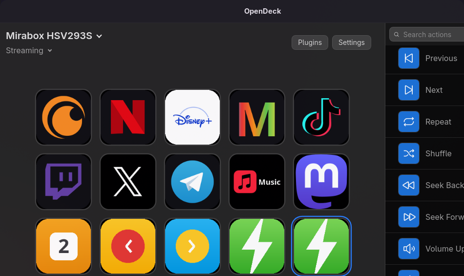

# StreamDock ES — soporte para Ajazz AKP153 / Mirabox HSV293S

**Versión en español, con Linux y Windows cuidados de verdad.**
Fork de [4ndv/opendeck-akp153](https://github.com/4ndv/opendeck-akp153), el plugin
no oficial de OpenDeck para los stream decks de la familia Mirabox HSV293S.

> Read this in [English](README.en.md).



*OpenDeck con este plugin: el aparato aparece como «Mirabox HSV293S» y con **15
teclas**, no 18. Antes salían 18 y tres de ellas no existían.*

---

## Qué cambia respecto al original

### 1. Arreglado: los aparatos de 15 teclas ya no tienen 3 teclas fantasma

El plugin original declaraba **18 ranuras para todos los modelos**:

```rust
pub const ROW_COUNT: usize = 3;
pub const COL_COUNT: usize = 6;
pub const KEY_COUNT: usize = ROW_COUNT * COL_COUNT;   // 18, siempre
```

Pero el AKP153, el HSV293S y todos sus clones son **3 filas × 5 columnas = 15
teclas**. El resultado era que OpenDeck te mostraba una rejilla de 3×6 con **tres
teclas que no existen** (la 6ª columna: ranuras 5, 11 y 17). Se podían configurar,
se guardaban en el perfil… y no se encendían nunca, porque el firmware no tiene
esas teclas.

Ahora el número de teclas es **por modelo** (`Kind::key_count()`), así que:

- los modelos **v1** (15 teclas) se registran como **3×5**;
- los modelos **v2/v3** (18 ranuras) siguen registrándose como **3×6**.

### 2. Todo en español

README, descripción y nombres del plugin en `manifest.json`, mensajes de log y
esta documentación.

> **Ojo con la interfaz de OpenDeck:** el desplegable *Language* ofrece «Español»,
> pero OpenDeck todavía **no trae `translations/es.json`**, así que su interfaz sigue
> saliendo en inglés (`Settings`, `Plugins`, `Search actions`…). Lo único que hace ese
> ajuste hoy es decirle a los plugins qué idioma prefiere el usuario: los
> property inspectors y las acciones sí pueden responder en español.
> Se explica más abajo, en «La interfaz de OpenDeck, en inglés».

### 3. Instaladores de verdad

- `install-linux.sh` — reglas udev + OpenDeck + plugin, en un comando.
- `install-windows.ps1` — plugin + reglas de dispositivo en Windows.

### 4. Integración continua para Linux **y** Windows

El README original decía, con razón, `Windows: Zero effort`. Aquí hay un
workflow de GitHub Actions que **compila y publica los dos binarios** en cada
etiqueta: `.so`/ELF para Linux y `.exe` para Windows, además del `.plugin.zip`
listo para instalar.

### 5. Migrador de perfiles

Si ya tenías perfiles hechos con la rejilla de 18 ranuras, `tools/migrar-perfiles.py`
los reordena a 15 sin perder nada (`5, 11 y 17` se descartan porque apuntaban a
teclas inexistentes).

---

## Dispositivos soportados

| Modelo | VID:PID | Teclas |
|---|---|---|
| Mirabox HSV293S | `5548:6670` | 15 (3×5) |
| Mirabox HSV293SV3 | `6603:1014`, `6603:1005` | 18 (3×6) |
| Ajazz AKP153 | `5548:6674` | 15 (3×5) |
| Ajazz AKP153E | `0300:1010` | 15 (3×5) |
| Ajazz AKP153R | `0300:1020` | 15 (3×5) |
| Ajazz AKP153E (rev. 2) | `0300:3010` | 18 (3×6) |
| Ajazz AKP153R (rev. 2) | `0300:3011` | 18 (3×6) |
| Mars Gaming MSD-ONE | `0b00:1000` | 15 (3×5) |
| Mars Gaming MSD-ONE | `0b00:1005` | 18 (3×6) |
| Maddog GK150K | `0c00:1000` | 15 (3×5) |
| Risemode Vision 01 | `0a00:1001` | 15 (3×5) |
| Soomfon Stream Controller XF-CN001 | `1500:3003` | 15 (3×5) |
| Soomfon Studio Control Deck | `5548:6670` | 15 (3×5) |
| TMICE Stream Controller | `0500:1001` | 15 (3×5) |
| Womier D15 | `0600:1000` | 15 (3×5) |
| Monstargear MonstarDeck TS115 | `0400:1000` | 15 (3×5) |
| Streonor Standard S15 | `1500:3005` | 18 (3×6) |

> El Soomfon Studio Control Deck comparte VID:PID con el Mirabox HSV293S, así que
> OpenDeck lo mostrará como «Mirabox HSV293S». No es un fallo.

Requiere **OpenDeck 2.5.0 o superior**.

---

## Instalación

### Linux (Arch, Debian/Ubuntu, Fedora…)

```bash
git clone https://github.com/pilahito/streamdock-es.git
cd streamdock-es
./install-linux.sh
```

El script:

1. instala OpenDeck si no está (detecta `pacman`, `apt` o `dnf`);
2. copia `40-opendeck-akp153.rules` a `/etc/udev/rules.d/`;
3. recarga las reglas udev para que `/dev/hidraw*` sea accesible sin `sudo`;
4. deja el plugin listo en `~/.config/opendeck/plugins/`.

Después, desenchufa y vuelve a enchufar el aparato y reinicia OpenDeck.

### Windows 10/11

```powershell
git clone https://github.com/pilahito/streamdock-es.git
cd streamdock-es
powershell -ExecutionPolicy Bypass -File .\install-windows.ps1
```

Descarga el último `.plugin.zip` de [releases](../../releases), lo descomprime en
`%APPDATA%\opendeck\plugins\` y comprueba que el `.exe` esté ahí.

### A mano (cualquier sistema)

1. Descarga `opendeck-akp153.plugin.zip` de [releases](../../releases).
2. En OpenDeck: **Plugins → Install from file**.
3. Linux: copia `40-opendeck-akp153.rules` a `/etc/udev/rules.d/` y ejecuta
   `sudo udevadm control --reload-rules && sudo udevadm trigger`.
4. Desenchufa y vuelve a enchufar el aparato. Reinicia OpenDeck.

---

## Migrar perfiles ya existentes

Si venías del plugin original, tus perfiles tienen 18 ranuras y al pasar a 15 se
desplazan. Con OpenDeck **cerrado**:

```bash
python3 tools/migrar-perfiles.py --simular     # ver qué haría
python3 tools/migrar-perfiles.py               # aplicarlo (hace copia .bak)
```

La conversión es:

| Perfil nuevo | Perfil viejo |
|---|---|
| `0–4` (fila 1) | `0–4` |
| `5–9` (fila 2) | `6–10` |
| `10–14` (fila 3) | `12–16` |
| — | `5, 11, 17` se descartan (eran las teclas fantasma) |

---

## Compilar

Necesitas Rust 1.87 o superior.

```bash
# Linux
cargo build --release --target x86_64-unknown-linux-gnu

# Windows (cross-compilando desde Linux)
rustup target add x86_64-pc-windows-gnu
cargo build --release --target x86_64-pc-windows-gnu
```

Para montar el paquete `.plugin.zip` como en los releases:

```bash
./empaquetar.sh 0.12.0
```

---

## La interfaz de OpenDeck, en inglés

OpenDeck sí tiene i18n: `src/lib/i18n.ts` carga las traducciones con
`import.meta.glob("../../translations/*.json")`, y hay `de`, `en`, `ko`, `pt_BR`,
`sv` y `uk`. Lo que **no** hay es `es.json`, así que al elegir «Español» en los
ajustes la interfaz cae al `FALLBACK_LOCALE` (inglés).

Ese ajuste, hoy, solo sirve para decirle a los plugins el idioma del usuario: el
plugin recibe `"language": "es"` en el `info` de arranque y puede responder en
español en sus property inspectors y sus acciones. La interfaz de OpenDeck no.

Para tenerlo entero en español hay que traducir `translations/en.json` (~10 KB,
unas 250 cadenas) a `translations/es.json` y proponerlo en
[nekename/OpenDeck](https://github.com/nekename/OpenDeck). No hace falta tocar
código: con dejar el fichero en `translations/`, el glob lo recoge y el desplegable
de idioma lo usa.

---

## Problemas conocidos

- Todos los aparatos **v1** comparten el mismo número de serie
  (`355499441494`). No puedes usar dos v1 a la vez; sí uno v1 y otro v2/v3.
- La lectura de teclas (`process_input`) no recibe contexto de `mirajazz`, así que
  la disposición activa (15 o 18) se guarda en un estático. Con un solo aparato
  conectado —el caso normal— no hay problema.
- macOS no está probado. El original tampoco lo probaba.

## Licencia y créditos

GPL-3.0, igual que el original. Todo el mérito del soporte de hardware es de
[4ndv](https://github.com/4ndv) y de los contribuidores de
[elgato-streamdeck](https://github.com/streamduck-org/elgato-streamdeck) y
[OpenDeck](https://github.com/nekename/OpenDeck).
